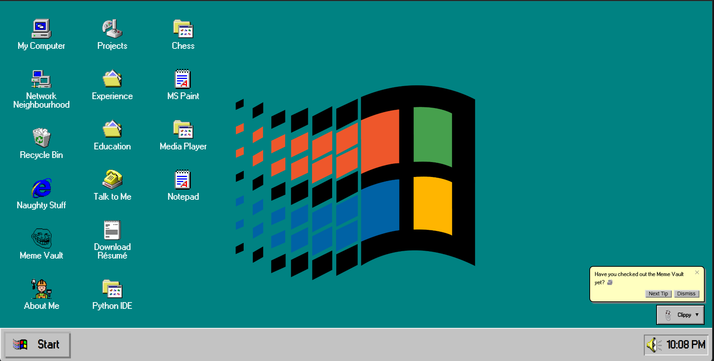
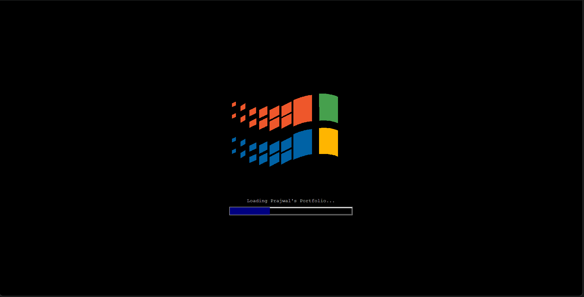
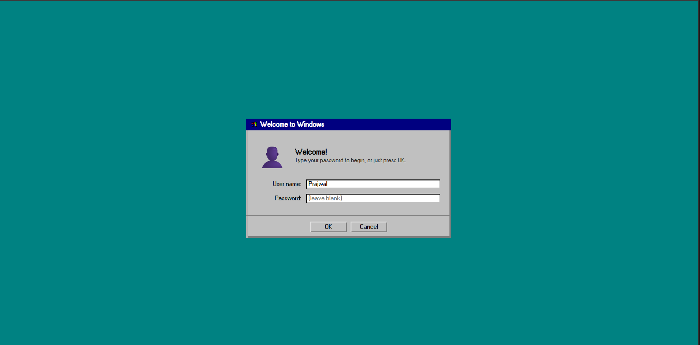
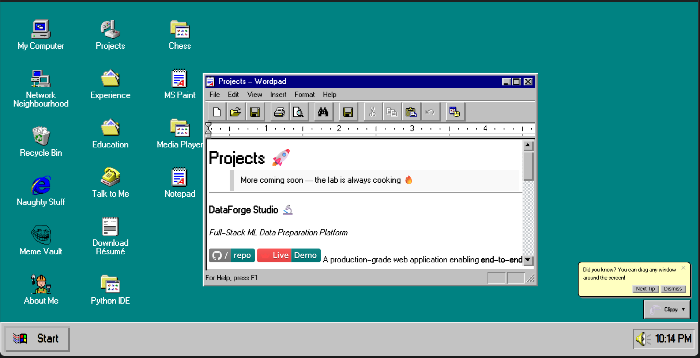
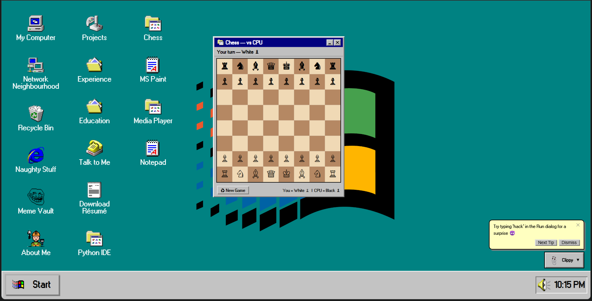
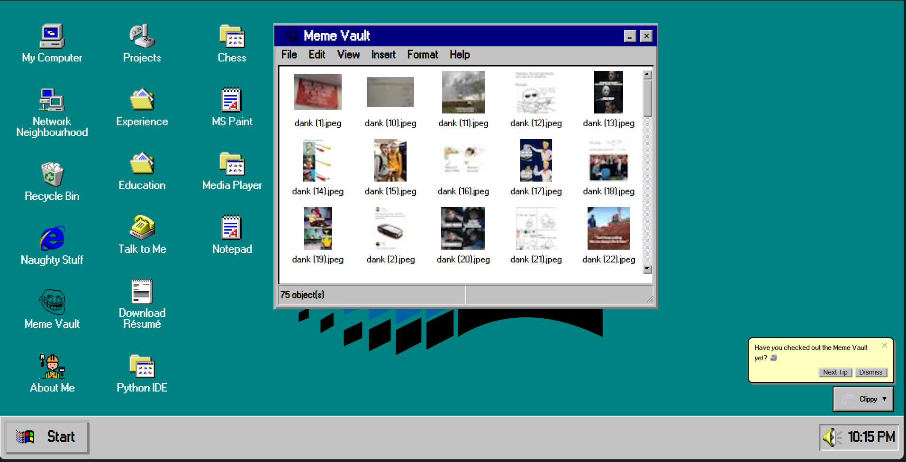

<<<<<<< HEAD
# 🖥️ Prajwal A — Windows 95 Portfolio

[](https://prajwal-dev.vercel.app/)
[](https://nextjs.org)
[](LICENSE)

A retro Windows 95-themed developer portfolio for **Prajwal A**, AI/ML Engineer.



---

## 📸 Screenshots

| Boot Screen | Login | Desktop |
|---|---|---|
|  |  |  |

| Projects | Chess | Meme Vault |
|---|---|---|
|  |  |  |

---

## 🚀 Getting Started
```bash
npm install
npm run dev
```

Open [http://localhost:3000](http://localhost:3000)

---

## 📁 Project Structure
```
app/
  markdown/         ← Edit your content here (MDX files)
    aboutMe.mdx     ← About, Skills, Certifications
    projects.mdx    ← Projects
    experience.mdx  ← Work Experience
    education.mdx   ← Education
    contact.mdx     ← Social links
    guide.mdx       ← Desktop guide popup
  globals.scss      ← Global styles
  layout.js         ← Metadata (update title/description)

components/
  boot/             ← DOS boot sequence + Win95 logo
  login/            ← Win95 Login screen
  chess/            ← Playable Chess vs CPU
  paint/            ← MS Paint clone
  compiler/         ← Python IDE (Pyodide)
  music/            ← Media Player with visualizer
  screensaver/      ← Bouncing logo screensaver
  clippy/           ← Clippy assistant
  notepad/          ← Notepad with blog
  wordpad/          ← Wordpad-style window
  mail/             ← Contact form (EmailJS)
  fileManager/      ← Meme Vault gallery
  misc/             ← RickRoll, BlueScreen

public/
  Prajwal_A_Resume.pdf  ← Your resume
  windowsIcons/         ← All Win95 icons
  memes/                ← Meme Vault images
  screenshots/          ← README screenshots
```

---

## ✉️ Setting Up EmailJS (Contact Form)

1. Go to [emailjs.com](https://www.emailjs.com/) and create a free account
2. Create a **Service** (Gmail, Outlook, etc.)
3. Create an **Email Template**
4. Create a `.env.local` file in the root:
```env
   NEXT_PUBLIC_EMAILJS_SERVICE_ID=your_service_id
   NEXT_PUBLIC_EMAILJS_TEMPLATE_ID=your_template_id
   NEXT_PUBLIC_EMAILJS_PUBLIC_KEY=your_public_key
```

---

## 🎮 Features

| Feature | Description |
|---|---|
| 💾 Boot Screen | DOS text + Win95 logo + progress bar |
| 🔐 Login Screen | Win95-style password prompt |
| 📝 Wordpad Windows | About Me, Projects, Experience, Education |
| ✉️ Mail | EmailJS-powered contact form |
| ♟️ Chess | Playable chess vs CPU |
| 🗿 Meme Vault | Image gallery file manager |
| 🎨 MS Paint | Fully working paint clone |
| 🐍 Python IDE | Run real Python in browser (Pyodide) |
| 🎵 Media Player | Chiptune tracks with visualizer |
| 💤 Screensaver | Bouncing Win95 logo after 30s idle |
| 📎 Clippy | Helpful tips assistant |
| 📝 Notepad | Blog/thoughts editor |
| 😈 Naughty Stuff | Rick Roll Easter egg |
| 💀 Blue Screen | Shut Down → BSOD |
| 🖱️ Context Menu | Right-click on desktop |
| 🚀 Start Menu | Programs, Run dialog, Easter eggs |

---

## 🌐 Deploy to Vercel

1. Push to GitHub
2. Go to [vercel.com](https://vercel.com) → Import project
3. Add your `.env.local` variables in Vercel dashboard
4. Deploy! 🚀

---

## ✏️ Customisation Tips

- **Update content** → Edit files in `app/markdown/`
- **Add projects** → Edit `app/markdown/projects.mdx`
- **Change certifications** → Edit `app/markdown/aboutMe.mdx`
- **Add memes** → Drop `.jpeg` files into `public/memes/`
- **Change title** → Edit `app/layout.js` metadata

---

## 👨‍💻 Author

**Prajwal A**
- 📧 prajwala27112005@gmail.com
- 🐙 [github.com/Prajwal18py](https://github.com/Prajwal18py)
- 🎓 B.Tech AI/ML — Alliance University (2024-2028)

---

## 📄 License

MIT License — feel free to use and modify!
=======
# prajwal-portfolio
>>>>>>> 74b614cc09f4d1340f3f3b0a8daf8671cfd0597a
